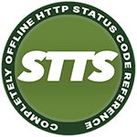
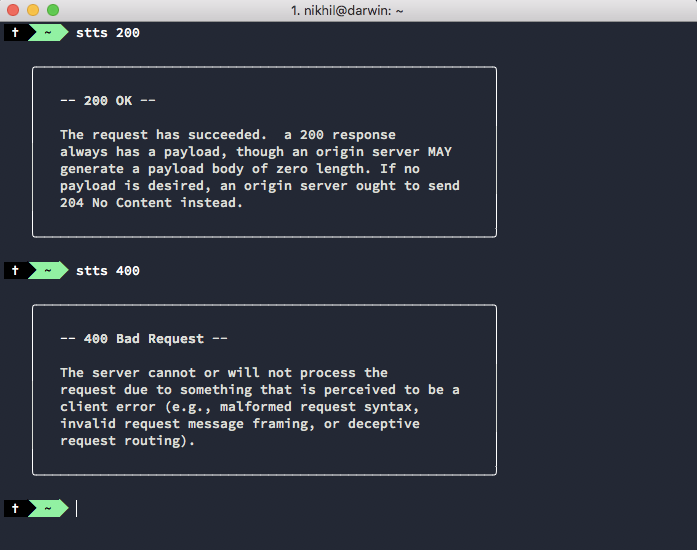

STTS is a quick, completely offline reference for HTTP status codes.

## Screenshot



## Installation

Install `stts` globally to use it in your terminal no matter where you are in your folder structure.

```bash
npm i -g stts
```

## Usage

```bash
stts <statusCode>
# eg: stts 409
```

## List all status codes and summaries 

Use the `-l` or `-list` flag to list all status codes along with a short description. You don't need to use a status code here.

Usage:
```bash
stts -l

# `stts -list` will also have the same behaviour
```

**Note**: This uses ``node --print "http.STATUS_CODES"` behind the scenes.

## Plan text mode

Include a `-t` argument to get the output in plan text. This is useful if you'd want to pipe the output to clipboard.

```bash
stts <statusCode> -t
# eg: stts 301 -t
```

## Status Code Data

All the reference text is from [https://httpstatuses.com/](https://httpstatuses.com/). Thanks to [Runscope](https://www.runscope.com/) for sponsoring it.

## How to

I wrote a quick how-to about how I made `stts`: [https://nikhilvijayan.com/http-status-code-checker](https://nikhilvijayan.com/http-status-code-checker).
